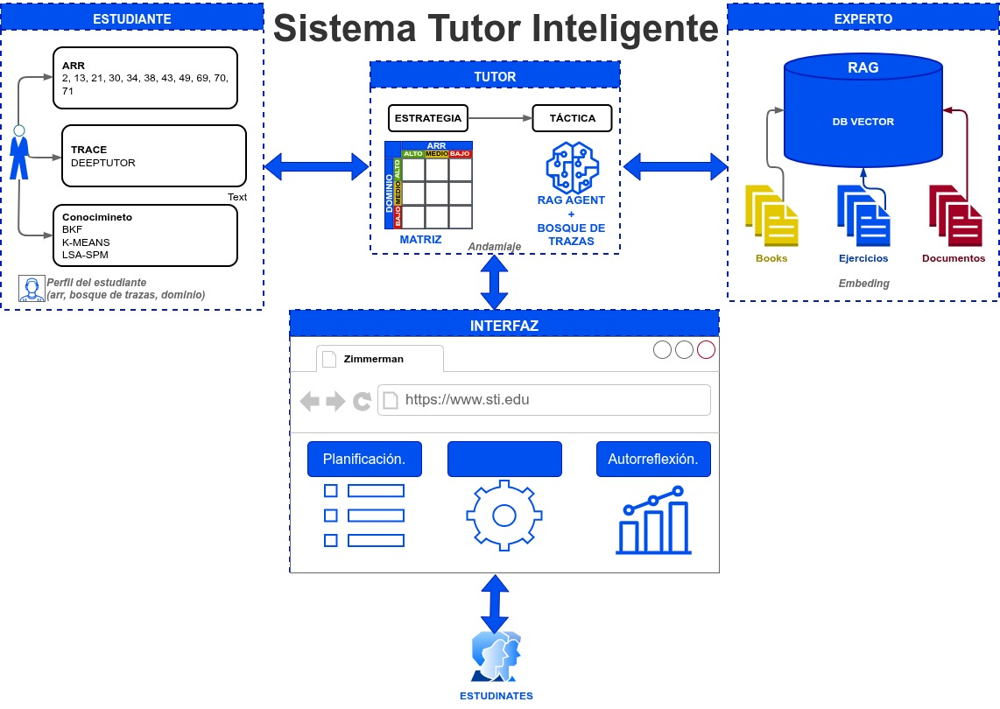

# DeepTutor Backend



> Turnos durables + Tools (nivel 1) + Capabilities (nivel 2). `CLI | WS /ws | SDK` → `TurnApplicationService` → `ChatOrchestrator` → `chat`.

## 2 min

```bash
pip install -U deeptutor
deeptutor init
deeptutor start
deeptutor run chat "Explique Fourier"
```

```bash
deeptutor chat
deeptutor kb create my-kb --doc libro.pdf
deeptutor serve --port 8001
```

<details>
<summary><strong>Extiende</strong></summary>

Tools toggleables (`/settings/tools`): `brainstorm`, `web_search`, `paper_search`, `reason`, `geogebra_analysis`, `imagegen`, `videogen`. Resto context-gated (`tool_composition.py`).

Capabilities: `chat` (default), `deep_solve`, `deep_question`, `deep_research`, `visualize`, `math_animator`, `mastery_path`, `immersive_reading`, `course_study`, `immersive_watching`, `ask_questions`.

</details>

<details>
<summary><strong>Config y deploy</strong></summary>

Settings en `data/user/settings/*.json`. Requiere `Python 3.11–3.14`.

```bash
docker run --rm -p 127.0.0.1:3782:3782 -v deeptutor-data:/app/data ghcr.io/hkuds/deeptutor:latest
```

Fuente: `git clone https://github.com/HKUDS/DeepTutor.git` → `pip install -e .` → `deeptutor start --dev`.

</details>
